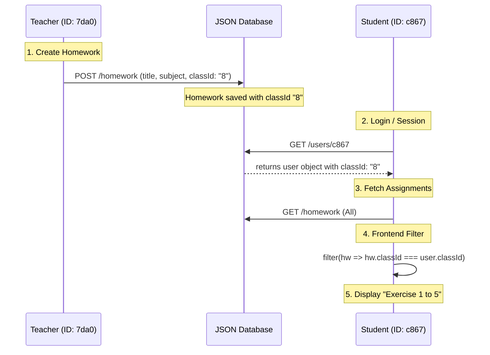

# 📡 BLS Data Flow & Connectivity Map

To ensure a professional and error-free system, the data flow must be strictly synchronized. Below is the blueprint of how Teachers and Students connect in the BLS platform.

---

## 1. Homework Lifecycle Flow

---

## 2. ⚡ Modern Connectivity Techniques (Implemented)

### A. The "Force-Sync" Pattern (AuthContext)
**Problem:** If an admin changes a student's class while they are logged in, their `localStorage` becomes stale.
**Solution:** On app load, the [AuthContext](file:///d:/blsschool-main%20-%20Copy/src/contexts/AuthContext.tsx#6-13) now re-fetches the user object directly from the database. This ensures the student always has the correct `classId` for their assignments.

### B. The "Resilient Filtering" Pattern (api.ts)
**Problem:** `json-server` can sometimes misinterpret string-IDs as numbers in query parameters (`?classId=8`), leading to unexpected empty results.
**Solution:** We now fetch the dataset and perform a **string-safe filter** in the frontend. This guarantees that `8` and `"8"` always match, preventing "hidden" assignments.

### C. Cross-Component Events (lib/events.ts)
**Problem:** Dashboard doesn't update when a teacher adds homework in another tab.
**Solution:** We use a [CustomEvent](file:///d:/blsschool-main%20-%20Copy/src/lib/events.ts#13-17) system (`EVENTS.HOMEWORK_CHANGE`). When a teacher submits, it broadcasts a signal, and the student's dashboard catches it to auto-refresh their list instantly.

---

## 3. Data Integrity Rules
| Entity | Required Primary Link | Secondary Link |
| :--- | :--- | :--- |
| **Homework** | `classId` (String) | `createdBy` (Teacher ID) |
| **Student** | `classId` (String) | [id](file:///d:/blsschool-main%20-%20Copy/src/components/layout/Sidebar.tsx#43-176) (Global) |
| **Submission** | `homeworkId` | `studentId` |
| **Attendance** | `classId` + [date](file:///d:/blsschool-main%20-%20Copy/src/lib/api.ts#34-36) | `records[].studentId` |

> [!TIP]
> **Pro Tip:** Always ensure that when you delete/re-create a student in the database, you update their `studentId` in any existing `attendance` or `feeRecords`. I have synchronized these for you in [db.json](file:///d:/blsschool-main%20-%20Copy/db.json).
